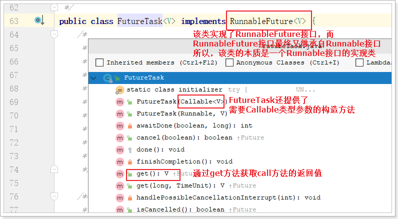

# 1. JUC概述及回顾

## 1.1. JUC是什么？

在 Java 5.0 提供了 `java.util.concurrent`(简称JUC)包，在此包中增加了在并发编程中很常用的工具类。此包包括了几个小的、已标准化的可扩展框架，并提供一些功能实用的类，没有这些类，一些功能会很难实现或实现起来冗长乏味。

参照JDK文档：


## 1.2. 进程和线程

进程：进程是一个具有一定**独立功能的程序**关于某个数据集合的一次运行活动。它是操作系统动态执行的基本单元，在传统的操作系统中，进程既是基本的分配单元，也是基本的执行单元。

线程：通常在**一个进程中可以包含若干个线程**，当然一个进程中至少有一个线程，不然没有存在的意义。线程可以利用进程所拥有的资源，在引入线程的操作系统中，通常都是把进程作为分配资源的基本单位，而把线程作为独立运行和独立调度的基本单位，由于线程比进程更小，基本上不拥有系统资源，故对它的调度所付出的开销就会小得多，能更高效的提高系统多个程序间并发执行的程度。

例如：运动会  --进程    各项目比赛 --线程


生活实例：

​		使用QQ，查看进程一定有一个QQ.exe的进程，我可以用qq和A文字聊天，和B视频聊天，给C传文件，给D发一段语言，QQ支持录入信息的搜索。

​		大四的时候写论文，用word写论文，同时用QQ音乐放音乐，同时用QQ聊天，多个进程。

​		word如没有保存，停电关机，再通电后打开word可以恢复之前未保存的文档，word也会检查你的拼写，两个线程：容灾备份，语法检查


## 1.3. 并行和并发

并发：同一时刻多个线程在访问同一个资源，多个线程对一个点

​      例子：小米9今天上午10点，限量抢购

​            春运抢票

​            微信抢红包

​            电商秒杀...

并行：多项工作一起执行，之后再汇总

​      例子：泡方便面，电水壶烧水，一边撕调料倒入桶中


## 1.4. wait/sleep的区别

功能都是当前线程暂停，有什么区别？

wait：**放开手去睡**，放开手里的锁

sleep：**握紧手去睡**，醒了手里还有锁

wait是Object的方法，sleep是thread的方法


## 1.5. 线程的状态

**（1）New 新建状态**

**（2）Runnable 运行状态**

**（3）Blocked 阻塞状态**（如果遇到锁，线程就会变为阻塞状态等待另一个线程释放锁）

**（4）Waiting 等待状态**（无限期等待）

**（5）Time_Waiting 超时等待状态**（有明确结束时间的等待状态）

**（6）Terminated 终止状态**（当线程结束完成之后就会变成此状态）

```java
 public enum State {
        /**
         * Thread state for a thread which has not yet started.
         */
        NEW,

        /**
         * Thread state for a runnable thread.  A thread in the runnable
         * state is executing in the Java virtual machine but it may
         * be waiting for other resources from the operating system
         * such as processor.
         */
        RUNNABLE,

        /**
         * Thread state for a thread blocked waiting for a monitor lock.
         * A thread in the blocked state is waiting for a monitor lock
         * to enter a synchronized block/method or
         * reenter a synchronized block/method after calling
         * {@link Object#wait() Object.wait}.
         */
        BLOCKED,

        /**
         * Thread state for a waiting thread.
         * A thread is in the waiting state due to calling one of the
         * following methods:
         * <ul>
         *   <li>{@link Object#wait() Object.wait} with no timeout</li>
         *   <li>{@link #join() Thread.join} with no timeout</li>
         *   <li>{@link LockSupport#park() LockSupport.park}</li>
         * </ul>
         *
         * <p>A thread in the waiting state is waiting for another thread to
         * perform a particular action.
         *
         * For example, a thread that has called <tt>Object.wait()</tt>
         * on an object is waiting for another thread to call
         * <tt>Object.notify()</tt> or <tt>Object.notifyAll()</tt> on
         * that object. A thread that has called <tt>Thread.join()</tt>
         * is waiting for a specified thread to terminate.
         */
        WAITING,

        /**
         * Thread state for a waiting thread with a specified waiting time.
         * A thread is in the timed waiting state due to calling one of
         * the following methods with a specified positive waiting time:
         * <ul>
         *   <li>{@link #sleep Thread.sleep}</li>
         *   <li>{@link Object#wait(long) Object.wait} with timeout</li>
         *   <li>{@link #join(long) Thread.join} with timeout</li>
         *   <li>{@link LockSupport#parkNanos LockSupport.parkNanos}</li>
         *   <li>{@link LockSupport#parkUntil LockSupport.parkUntil}</li>
         * </ul>
         */
        TIMED_WAITING,

        /**
         * Thread state for a terminated thread.
         * The thread has completed execution.
         */
        TERMINATED;
    }
```


## 1.6. 创建线程回顾

**创建线程常用两种方式**：

1. 继承Thread：java是单继承，资源宝贵，要用接口方式
2. 实现Runable接口


**继承Thread抽象类**：

```java
public class MyThread extends Thread
new MyThread().start();
```


**实现Runnable接口**的方式：

1. 新建类实现runnable接口。这种方法会新增类，有更好的方法

```java
class MyRunnable implements Runnable//新建类实现runnable接口
new Thread(new MyRunnable(), name).start // 使用Rannable实现类创建进程，name是线程名
```

2. 匿名内部类。

```java
new Thread(new Runnable() {
    @Override
    public void run() {
 		// 调用资源方法，完成业务逻辑
    }
}, "your thread name").start();
```


## 1.7. lambda表达式

之前说了Runnable接口的两种写法，其实还有第三种写法：

1. 创建类实现Runnable接口
2. 编写匿名内部类实现Runnable接口
3. **lambda表达式**：这种方法代码更简洁精炼

```
new Thread(() -> {

}, "your thread name").start();
```


### 1.7.1. 什么是lambda

Lambda 是一个匿名函数，我们可以把 Lambda表达式理解为是一段可以传递的代码（将代码像数据一样进行传递）。可以写出更简洁、更灵活的代码。作为一种更紧凑的代码风格，使Java的语言表达能力得到了提升。

Lambda 表达式在Java 语言中引入了一个新的语法元素和操作符。这个操作符为 “->” ， 该操作符被称为 Lambda 操作符或剪头操作符。它将 Lambda 分为两个部分：

- 左侧：指定了 Lambda 表达式需要的所有参数
- 右侧：指定了 Lambda 体，即 Lambda 表达式要执行的功能


### 1.7.2. 案例

在一个方法中调用接口中的方法：传统写法

```java
interface Foo {
    public int add(int x, int y);
}

public class LambdaDemo {
    public static void main(String[] args) {
        Foo foo = new Foo() {
            @Override
            public int add(int x, int y) {
                return x + y;
            }
        };
        System.out.println(foo.add(10, 20));
    }
}
```

接下来，要用lambda表达式改造。其实是改造main方法

```java
public static void main(String[] args) {
    Foo foo = (int x, int y)->{
        return x + y;
    };
    System.out.println(foo.add(10, 20));
}
```

改造口诀：`拷贝小括号()，写死右箭头->，落地大括号{...}`

思考：如果Foo接口有多个方法，还能使用lambda表达式吗？


### 1.7.3. 函数式接口

lambda表达式，**必须是函数式接口，必须只有一个抽象方法**，如果**接口只有一个抽象方法**java默认它为**函数式接口**。
为了正确使用Lambda表达式，需要给接口加个注解：@FunctionalInterface。如有两个方法，立刻报错。

Runnable接口为什么可以用lambda表达式？

```java
@FunctionalInterface
public interface Runnable {
    /**
     * When an object implementing interface <code>Runnable</code> is used
     * to create a thread, starting the thread causes the object's
     * <code>run</code> method to be called in that separately executing
     * thread.
     * <p>
     * The general contract of the method <code>run</code> is that it may
     * take any action whatsoever.
     *
     * @see     java.lang.Thread#run()
     */
    public abstract void run();
}
```

发现Runnable接口上有一个注解：@FunctionalInterface

并且该接口只有一个方法：run()方法


其实，**函数式接口必须只有一个方法，这个描述并不准确，它还允许有default方法和静态方法。**

例如，在Foo接口中，又添加了sub方法和mul方法：

```java
interface Foo {

    public int add(int x, int y); // 抽象方法

    default int sub(int x, int y){ // default方法
        return x - y;
    }
    public static int mul(int x, int y){ // 静态方法
        return x * y;
    }
}

public class LambdaDemo {

    public static void main(String[] args) {

        Foo foo = (int x, int y)->{  // lambda表达式实现抽象方法
            return x + y;
        };
        System.out.println(foo.add(10, 20)); // 调用抽象方法
        System.out.println(foo.sub(30, 15)); // 调用default方法
        System.out.println(Foo.mul(10, 50)); // 通过Foo调用静态方法
    }
}
```


### 1.7.4. 小结

lambda表达式实现接口的前提是

​		**有且只有一个抽象方法，可以选择@FunctionalInterface注解增强函数式接口定义**

改造口诀

​		**拷贝小括号(形参列表)，写死右箭头 ->，落地大括号 {方法实现}**


# 2.synchronized

## 2.1. synchronized回顾

### 2.2.1 synchronized的作用

**官方解释：**
Synchronized methods enable a simple strategy for preventing thread interference and memory consistency errors：if an objects is visible to more than one thread,all reads or writes to thar object’s variable are done through synchronized methods.

翻译：
Synchronized方法支持一种简单的策略，用于防止线程干扰和内存一致性错误：如果一个对象对多个线程可见，则对该对象变量的所有读或写操作都通过Synchronized方法完成。

**总结一句话:能够保证在同一时刻最多只有一个线程执行该段代码，以保证并发安全的效果。**


### 2.2.2 synchronized用法

**synchronized是Java中的关键字，是一种同步锁。**它修饰的对象有以下几种： 

1. **修饰一个代码块**，被修饰的代码块称为同步语句块，其作用的范围是大括号{}括起来的代码，作用的对象是调用这个代码块的对象； 

2. **修饰一个方法**，被修饰的方法称为同步方法，其作用的范围是整个方法，作用的对象是调用这个方法的对象； 

 虽然可以使用synchronized来定义方法，但synchronized并不属于方法定义的一部分，因此，synchronized关键字不能被继承。如果在父类中的某个方法使用了synchronized关键字，而在子类中覆盖了这个方法，在子类中的这个方法默认情况下并不是同步的，而必须显式地在子类的这个方法中加上synchronized关键字才可以。当然，还可以在子类方法中调用父类中相应的方法，这样虽然子类中的方法不是同步的，但子类调用了父类的同步方法，因此，子类的方法也就相当于同步了。


### 2.2.3 synchronized卖票例子

**`多线程编程模板上`：**

​	线程 操作 资源类  高内聚低耦合

**实现步骤：**

1. 创建资源类
2. 资源类里创建同步方法、同步代码块
3. 多线程调用


例子：**卖票程序**

创建工程，并添加了一个SaleTicket.java

 

内容如下：

```java
class Ticket {

    private Integer number = 20;

    public synchronized void sale(){
        if (number <= 0) {
            System.out.println("票已售罄！！！");
            return;
        }
        try {
            System.out.println(Thread.currentThread().getName() + "开始买票，当前票数：" + number);
            Thread.sleep(200);
            System.out.println(Thread.currentThread().getName() + "买票结束，剩余票数：" + --number);
        } catch (InterruptedException e) {
            e.printStackTrace();
        }
    }
}

// 在main方法中创建多线程方法，测试卖票业务
public class SaleTicket {

    public static void main(String[] args) {

        Ticket ticket = new Ticket();

        new Thread(() -> {
            for (int i = 0; i < 30; i++) {
                ticket.sale();
            }
        }, "AAA").start();
        new Thread(() -> {
            for (int i = 0; i < 30; i++) {
                ticket.sale();
            }
        }, "BBB").start();
        new Thread(() -> {
            for (int i = 0; i < 30; i++) {
                ticket.sale();
            }
        }, "CCC").start();

    }
}
```


## 2.2. synchronized的8锁问题

看下面这段儿代码，回答后面的8个问题：

```java
class Phone {

    public synchronized void sendSMS() throws Exception {
        //TimeUnit.SECONDS.sleep(4);
        System.out.println("------sendSMS");
    }

    public synchronized void sendEmail() throws Exception {
        System.out.println("------sendEmail");
    }

    public void getHello() {
        System.out.println("------getHello");
    }

}

public class Lock_8 {

    public static void main(String[] args) throws Exception {

        Phone phone = new Phone();
        Phone phone2 = new Phone();

        new Thread(() -> {
            try {
                phone.sendSMS();
            } catch (Exception e) {
                e.printStackTrace();
            }
        }, "AA").start();

        Thread.sleep(100);

        new Thread(() -> {
            try {
                phone.sendEmail();
                //phone.getHello();
                //phone2.sendEmail();
            } catch (Exception e) {
                e.printStackTrace();
            }
        }, "BB").start();
    }
}
```


多线程的8个问题：

1. 标准访问，先打印短信还是邮件
2. 停4秒在短信方法内，先打印短信还是邮件
3. 普通的hello方法，是先打短信还是hello
4. 现在有两部手机，先打印短信还是邮件
5. 两个静态同步方法，1部手机，先打印短信还是邮件
6. 两个静态同步方法，2部手机，先打印短信还是邮件
7. 1个静态同步方法，1个普通同步方法，1部手机，先打印短信还是邮件
8. 1个静态同步方法，1个普通同步方法，2部手机，先打印短信还是邮件


总结：

synchronized实现同步的基础：Java中的每一个对象都可以作为锁。具体表现为以下3种形式：

1. 对于普通同步方法，锁是当前实例对象。
2. 对于静态同步方法，锁是当前类的Class对象。
3. 对于同步方法块，锁是Synchonized括号里配置的对象

当一个线程试图访问同步代码块时，它首先必须得到锁，退出或抛出异常时必须释放锁。

也就是说：

​		如果**一个实例对象**的**非静态同步方法**获取锁后，该实例对象的其他非静态同步方法必须等待获取锁的方法释放锁后才能获取锁；可是**不同实例对象**的非静态同步方法因为用的**是不同对象的锁**，所以毋须等待其他实例对象的非静态同步方法释放锁，就可以获取自己的锁。

​		**所有的静态同步方法用的是同一把锁——类对象本身**。不管是不是同一个实例对象，只要是一个类的对象，一旦一个静态同步方法获取锁之后，其他对象的静态同步方法，都必须等待该方法释放锁之后，才能获取锁。

​		而静态同步方法（Class对象锁）与非静态同步方法（实例对象锁）之间是不会有竞态条件的。


# 3. Lock锁

首先看一下JUC的重磅武器——锁（Lock）

相比同步锁，JUC包中的Lock锁的功能更加强大，它提供了各种各样的锁（公平锁，非公平锁，共享锁，独占锁……），所以使用起来很灵活。


翻译过来就是：

> 锁实现提供了比使用同步方法和语句可以获得的更广泛的锁操作。它们允许更灵活的结构，可能具有非常不同的属性，并且可能支持多个关联的条件对象。


Lock是一个接口，这里主要有三个实现：ReentrantLock、ReentrantReadWriteLock.ReadLock、ReentrantReadWriteLock.WriteLock


## 3.1. ReentrantLock可重入锁

ReentrantLock使用方式参照官方文档：

​                                                                                        


使用ReentrantLock改造卖票程序：只需改造sale()方法

```java
class Ticket{

    private Integer number = 20;

    private ReentrantLock lock = new ReentrantLock();

    public void sale(){

        lock.lock();

        if (number <= 0) {
            System.out.println("票已售罄！");
            lock.unlock();
            return;
        }

        try {
            Thread.sleep(200);
            number--;
            System.out.println(Thread.currentThread().getName() + "买票成功，当前剩余：" + number);
        } catch (InterruptedException e) {
            e.printStackTrace();
        } finally {
            lock.unlock();
        }
    }
}
```


### 3.1.1. 	测试可重入性

可重入锁又名递归锁，是指在同一个线程在外层方法获取锁的时候，再进入该线程的内层方法会自动获取锁。Java中ReentrantLock和synchronized都是可重入锁，可重入锁的一个优点是**可一定程度避免死锁**。

例如下列伪代码：

```java
class A{
	public synchronized void aa{
		......
        bb();
        ......
	}
	public synchronized void bb{
		......
	}
}
A a = new A();
a.aa();
```

A类中有两个普通同步方法，都需要对象a的锁。如果是不可重入锁的话，aa方法首先获取到锁，aa方法在执行的过程中需要调用bb方法，此时锁被aa方法占有，bb方法无法获取到锁，这样就会导致bb方法无法执行，aa方法也无法执行，出现了死锁情况。可重入锁可避免这种死锁的发生。

```java
class Ticket{

    private Integer number = 20;

    private ReentrantLock lock = new ReentrantLock();

    public void sale(){

        lock.lock();

        if (number <= 0) {
            System.out.println("票已售罄！");
            lock.unlock();
            return;
        }

        try {
            Thread.sleep(200);
            number--;
            System.out.println(Thread.currentThread().getName() + "买票成功，当前剩余：" + number);
            // 调用check方法测试锁的可重入性
            this.check();
        } catch (InterruptedException e) {
            e.printStackTrace();
        } finally {
            lock.unlock();
        }
    }

    /**
     * 为了测试可重入锁，添加检查余票方法
     */
    public void check(){
        lock.lock();
        System.out.println("检查余票。。。。");
        lock.unlock();
    }
}
```

可以发现程序可以正常执行。。。说明该锁确实可重入。

```
AAA买票成功，当前剩余：19
检查余票。。。。
AAA买票成功，当前剩余：18
检查余票。。。。
AAA买票成功，当前剩余：17
检查余票。。。。
AAA买票成功，当前剩余：16
检查余票。。。。
AAA买票成功，当前剩余：15
检查余票。。。。
AAA买票成功，当前剩余：14
检查余票。。。。
AAA买票成功，当前剩余：13
检查余票。。。。
BBB买票成功，当前剩余：12
检查余票。。。。
BBB买票成功，当前剩余：11
检查余票。。。。
BBB买票成功，当前剩余：10
。。。。。。
```


### 3.1.2. 测试公平锁

ReentrantLock还可以实现公平锁。所谓公平锁，也就是在锁上等待时间最长的线程将获得锁的使用权。通俗的理解就是谁排队时间最长谁先执行获取锁。

```java
private ReentrantLock lock = new ReentrantLock(true);
```

测试结果：

```
AAA买票成功，当前剩余：19
检查余票。。。。
BBB买票成功，当前剩余：18
检查余票。。。。
CCC买票成功，当前剩余：17
检查余票。。。。
AAA买票成功，当前剩余：16
检查余票。。。。
BBB买票成功，当前剩余：15
检查余票。。。。
CCC买票成功，当前剩余：14
。。。。。。
```

可以看到ABC三个线程是按顺序买票成功的。


### 3.1.3. 限时等待

这个是什么意思呢？也就是通过我们的tryLock方法来实现，可以选择传入时间参数，表示等待指定的时间，无参则表示立即返回锁申请的结果：true表示获取锁成功，false表示获取锁失败。我们可以将这种方法用来解决死锁问题。


### 3.1.4. ReentrantLock和synchronized区别

（1）synchronized是独占锁，加锁和解锁的过程自动进行，易于操作，但不够灵活。ReentrantLock也是独占锁，加锁和解锁的过程需要手动进行，不易操作，但非常灵活。

（2）synchronized可重入，因为加锁和解锁自动进行，不必担心最后是否释放锁；ReentrantLock也可重入，但加锁和解锁需要手动进行，且次数需一样，否则其他线程无法获得锁。

（3）synchronized不可响应中断，一个线程获取不到锁就一直等着；ReentrantLock可以响应中断。


## 3.2. ReentrantReadWriteLock读写锁

​		在并发场景中用于解决线程安全的问题，我们几乎会高频率的使用到独占式锁，通常使用java提供的关键字synchronized或者concurrents包中实现了Lock接口的ReentrantLock。它们都是独占式获取锁，也就是在同一时刻只有一个线程能够获取锁。而在一些业务场景中，大部分只是读数据，写数据很少，如果仅仅是读数据的话并不会影响数据正确性（出现脏读），而如果在这种业务场景下，依然使用独占锁的话，很显然这将是出现性能瓶颈的地方。针对这种读多写少的情况，java还提供了另外一个实现Lock接口的**ReentrantReadWriteLock**(读写锁)。**读写锁允许同一时刻被多个读线程访问，但是在写线程访问时，所有的读线程和其他的写线程都会被阻塞**。

读写锁的特点：

1. 写写不可并发
2. 读写不可并发
3. 读读可以并发


### 3.2.1. 重写读写问题

接下来以缓存为例用代码演示读写锁，重现问题：

```java
class MyCache{
    
    private volatile Map<String, String> cache= new HashMap<>();

    public void put(String key, String value){
        try {
            System.out.println(Thread.currentThread().getName() + " 开始写入！");
            Thread.sleep(300);
            cache.put(key, value);
            System.out.println(Thread.currentThread().getName() + " 写入成功！");
        } catch (InterruptedException e) {
            e.printStackTrace();
        } finally {
        }
    }

    public void get(String key){
        try {
            System.out.println(Thread.currentThread().getName() + " 开始读出！");
            Thread.sleep(300);
            String value = cache.get(key);
            System.out.println(Thread.currentThread().getName() + " 读出成功！" + value);
        } catch (InterruptedException e) {
            e.printStackTrace();
        } finally {
        }
    }
}

public class ReentrantReadWriteLockDemo {

    public static void main(String[] args) {

        MyCache cache = new MyCache();

        for (int i = 1; i <= 5; i++) {
            String num = String.valueOf(i);
            // 开启5个写线程
            new Thread(()->{
                cache.put(num, num);
            }, num).start();
        }
        for (int i = 1; i <= 5; i++) {
            String num = String.valueOf(i);
            // 开启5个读线程
            new Thread(()->{
                cache.get(num);
            }, num).start();
        }
    }
}
```

打印结果：多执行几次，有很大概率不会出现问题


### 3.2.2. 读写锁的使用

改造MyCache，加入读写锁：

```java
class MyCache{
    private volatile Map<String, String> cache= new HashMap<>();
    // 加入读写锁
    ReentrantReadWriteLock rwl = new ReentrantReadWriteLock();

    public void put(String key, String value){
        // 加写锁
        rwl.writeLock().lock();
        try {
            System.out.println(Thread.currentThread().getName() + " 开始写入！");
            Thread.sleep(500);
            cache.put(key, value);
            System.out.println(Thread.currentThread().getName() + " 写入成功！");
        } catch (InterruptedException e) {
            e.printStackTrace();
        } finally {
            // 释放写锁
            rwl.writeLock().unlock();
        }
    }

    public void get(String key){
        // 加入读锁
        rwl.readLock().lock();
        try {
            System.out.println(Thread.currentThread().getName() + " 开始读出！");
            Thread.sleep(500);
            String value = cache.get(key);
            System.out.println(Thread.currentThread().getName() + " 读出成功！" + value);
        } catch (InterruptedException e) {
            e.printStackTrace();
        } finally {
            // 释放读锁
            rwl.readLock().unlock();
        }
    }
}
```


### 3.2.3. 锁降级

什么是锁降级，锁降级就是从写锁降级成为读锁。在当前线程拥有写锁的情况下，再次获取到读锁，随后释放写锁的过程就是锁降级。这里可以举个例子：

```java
public void test(){
    rwlock.writeLock().lock();
    System.out.println("获取到写锁。。。。");
    rwlock.readLock().lock();
    System.out.println("获取到读锁----------");
    rwlock.writeLock().unlock();
    System.out.println("释放写锁==============");
    rwlock.readLock().unlock();
    System.out.println("释放读锁++++++++++++++++");
}
```

打印效果：


~~~properties

锁降级的用途：
锁分为读锁 (共享锁)、写锁（排他锁）两种：

一个线程获取了写锁，其他线程无法获取写锁、读锁，进行阻塞；
一个线程获取了读锁，其他线程无法获取写锁（进行阻塞），但是可以获取读锁；
如果只使用写锁，那么释放写锁之后，其他线程就会获取到写锁或读锁，使用锁降级可以在释放写锁前获取读锁，这样其他的线程就只能获取读锁，对这个数据进行读取，但是不能获取写锁进行修改，只有当前线程释放了读锁之后才可以进行修改。

锁降级的意义是当前线程由write降为read，其他只需要read锁的线程可以去获取read锁，达到并发读的目的。
~~~


### 3.2.4. 读写锁总结

1. 支持公平/非公平策略

   

2. 支持可重入

   - 同一读线程在获取了读锁后还可以获取读锁
   - 同一写线程在获取了写锁之后既可以再次获取写锁又可以获取读锁

3. 支持锁降级，不支持锁升级

4. 读写锁如果使用不当，很容易产生“饥饿”问题：(写饥饿)

   在读线程非常多，写线程很少的情况下，很容易导致写线程“饥饿”，虽然使用“公平”策略可以一定程度上缓解这个问题，但是“公平”策略是以牺牲系统吞吐量为代价的。

5. Condition条件支持

   写锁可以通过`newCondition()`方法获取Condition对象。但是读锁是没法获取Condition对象，读锁调用`newCondition() `方法会直接抛出`UnsupportedOperationException`。


# 4. 线程间通信

面试题：两个线程打印

​	两个线程，一个线程打印1-52，另一个打印字母A-Z  打印顺序为12A34B...5152Z，要求用线程间通信


## 4.1. 回顾线程通信

先来简单案例：

​	两个线程操作一个初始值为0的变量，实现一个线程对变量增加1，一个线程对变量减少1，交替10轮。


线程间通信模型：

1. 生产者+消费者
2. 通知等待唤醒机制


**多线程编程模板中：**

1. 判断

2. 干活
3. 通知


代码实现：

```java
class ShareDataOne {
    private Integer number = 0;

    /**
     *  增加1
     */
    public synchronized void increment() throws InterruptedException {
        // 1. 判断
        if (number != 0) {
            this.wait();
        }

        // 2. 干活
        number++;
        System.out.println(Thread.currentThread().getName() + ": " + number);

        // 3. 通知
        this.notifyAll();
    }

    /**
     * 减少1
     */
    public synchronized void decrement() throws InterruptedException {
        // 1. 判断
        if (number != 1) {
            this.wait();
        }

        // 2. 干活
        number--;
        System.out.println(Thread.currentThread().getName() + ": " + number);

        // 3. 通知
        this.notifyAll();
    }
}

/**
 * 现在两个线程，
 * 可以操作初始值为零的一个变量，
 * 实现一个线程对该变量加1，一个线程对该变量减1，
 * 交替，来10轮。
 *
 * 笔记：Java里面如何进行工程级别的多线程编写
 * 1 多线程变成模板（套路）-----上
 *    1.1  线程    操作    资源类
 *    1.2  高内聚  低耦合
 * 2 多线程变成模板（套路）-----中
 *    2.1  判断
 *    2.2  干活
 *    2.3  通知
 */
public class NotifyWaitDemo {

    public static void main(String[] args) {
        ShareDataOne shareDataOne = new ShareDataOne();

        new Thread(()->{
            for (int i = 0; i < 10; i++) {
                try {
                    shareDataOne.increment();
                } catch (InterruptedException e) {
                    e.printStackTrace();
                }
            }
        }, "AAA").start();
        new Thread(()->{
            for (int i = 0; i < 10; i++) {
                try {
                    shareDataOne.decrement();
                } catch (InterruptedException e) {
                    e.printStackTrace();
                }
            }
        }, "BBB").start();

    }
}
```

部分打印结果：AAA和BBB交互执行，执行结果是1 0 1 0... 一共10轮

```
AAA: 1
BBB: 0
AAA: 1
BBB: 0
AAA: 1
BBB: 0
AAA: 1
BBB: 0
。。。。
```


**如果换成4个线程会怎样？**

改造mian方法，加入CCC和DDD两个线程：

```java
    public static void main(String[] args) {
        ShareDataOne shareDataOne = new ShareDataOne();

        new Thread(()->{
            for (int i = 0; i < 10; i++) {
                try {
                    shareDataOne.increment();
                } catch (InterruptedException e) {
                    e.printStackTrace();
                }
            }
        }, "AAA").start();
        new Thread(()->{
            for (int i = 0; i < 10; i++) {
                try {
                    shareDataOne.decrement();
                } catch (InterruptedException e) {
                    e.printStackTrace();
                }
            }
        }, "BBB").start();

        new Thread(()->{
            for (int i = 0; i < 10; i++) {
                try {
                    shareDataOne.increment();
                } catch (InterruptedException e) {
                    e.printStackTrace();
                }
            }
        }, "CCC").start();
        new Thread(()->{
            for (int i = 0; i < 10; i++) {
                try {
                    shareDataOne.decrement();
                } catch (InterruptedException e) {
                    e.printStackTrace();
                }
            }
        }, "DDD").start();
    }
```

打印结果，依然会有概率是，10101010...。

但是，多执行几次，也会出现错乱的现象：

```
AAA: 1
BBB: 0
CCC: 1
AAA: 2
CCC: 3
BBB: 2
CCC: 3
DDD: 2
AAA: 3
DDD: 2
CCC: 3
BBB: 2
```


## 4.2. 虚假唤醒

换成4个线程会导致错误，**虚假唤醒**

原因：在java多线程判断时，不能用if，程序出事出在了判断上面。

**注意，消费者被唤醒后是从wait()方法（被阻塞的地方）后面执行，而不是重新从同步块开头。**


如下图：


解决虚假唤醒：查看API，java.lang.Object的wait方法


中断和虚假唤醒是可能产生的，所以要用loop循环，if只判断一次，while是只要唤醒就要拉回来再判断一次。

if换成while

```java
class ShareDataOne {
    private Integer number = 0;

    /**
     *  增加1
     */
    public synchronized void increment() throws InterruptedException {
        // 1. 判断
        while (number != 0) {
            this.wait();
        }

        // 2. 干活
        number++;
        System.out.println(Thread.currentThread().getName() + ": " + number);

        // 3. 通知
        this.notifyAll();
    }

    /**
     * 减少1
     */
    public synchronized void decrement() throws InterruptedException {
        // 1. 判断
        while (number != 1) {
            this.wait();
        }

        // 2. 干活
        number--;
        System.out.println(Thread.currentThread().getName() + ": " + number);

        // 3. 通知
        this.notifyAll();
    }
}

/**
 * 现在两个线程，
 * 可以操作初始值为零的一个变量，
 * 实现一个线程对该变量加1，一个线程对该变量减1，
 * 交替，来10轮。
 *
 * 笔记：Java里面如何进行工程级别的多线程编写
 * 1 多线程变成模板（套路）-----上
 *    1.1  线程    操作    资源类
 *    1.2  高内聚  低耦合
 * 2 多线程变成模板（套路）-----中
 *    2.1  判断
 *    2.2  干活
 *    2.3  通知
 * 3 多线程编程模板（套路）-----下
 *    防止虚假唤醒（while）
 */
public class NotifyWaitDemo {

    public static void main(String[] args) {
        ShareDataOne shareDataOne = new ShareDataOne();

        new Thread(()->{
            for (int i = 0; i < 10; i++) {
                try {
                    shareDataOne.increment();
                } catch (InterruptedException e) {
                    e.printStackTrace();
                }
            }
        }, "AAA").start();
        new Thread(()->{
            for (int i = 0; i < 10; i++) {
                try {
                    shareDataOne.decrement();
                } catch (InterruptedException e) {
                    e.printStackTrace();
                }
            }
        }, "BBB").start();

        new Thread(()->{
            for (int i = 0; i < 10; i++) {
                try {
                    shareDataOne.increment();
                } catch (InterruptedException e) {
                    e.printStackTrace();
                }
            }
        }, "CCC").start();
        new Thread(()->{
            for (int i = 0; i < 10; i++) {
                try {
                    shareDataOne.decrement();
                } catch (InterruptedException e) {
                    e.printStackTrace();
                }
            }
        }, "DDD").start();
    }
}
```

再次测试，完美解决


## 4.3. 线程通信（Condition）

对标synchronized：


Condition：查看API，java.util.concurrent.locks


并提供了实现案例：


使用Condition实现线程通信，改造之前的代码（只需要改造ShareDataOne）：**删掉increment和decrement方法的synchronized**

```java
class ShareDataOne {
    private Integer number = 0;

    final Lock lock = new ReentrantLock(); // 初始化lock锁
    final Condition condition = lock.newCondition(); // 初始化condition对象

    /**
     *  增加1
     */
    public void increment() throws InterruptedException {
        lock.lock(); // 加锁
        try {
            // 1. 判断
            while (number != 0) {
                // this.wait();
                condition.await();
            }

            // 2. 干活
            number++;
            System.out.println(Thread.currentThread().getName() + ": " + number);

            // 3. 通知
            // this.notifyAll();
            condition.signalAll();
        } catch (InterruptedException e) {
            e.printStackTrace();
        } finally {
            lock.unlock();
        }
    }

    /**
     * 减少1
     */
    public void decrement() throws InterruptedException {
        lock.lock();
        try {
            // 1. 判断
            while (number != 1) {
                // this.wait();
                condition.await();
            }

            // 2. 干活
            number--;
            System.out.println(Thread.currentThread().getName() + ": " + number);

            // 3. 通知
            //this.notifyAll();
            condition.signalAll();
        } catch (InterruptedException e) {
            e.printStackTrace();
        } finally {
            lock.unlock();
        }
    }
}
```


## 4.4. 定制化调用通信

案例：

​		多线程之间按顺序调用，实现A->B->C。三个线程启动，要求如下：

​		AA打印5次，BB打印10次，CC打印15次

​		接着

​		AA打印5次，BB打印10次，CC打印15次

​		。。。打印10轮


分析实现方式：

1. 有一个锁Lock，3把钥匙Condition
2. 有顺序通知（切换线程），需要有标识位
3. 判断标志位
4. 输出线程名 + 内容
5. 修改标识符，通知下一个


具体实现：

 

内容：

```java
class ShareDataTwo {

    private Integer flag = 1; // 线程标识位，通过它区分线程切换
    private final Lock lock = new ReentrantLock();
    private final Condition condition1 = lock.newCondition();
    private final Condition condition2 = lock.newCondition();
    private final Condition condition3 = lock.newCondition();

    public void print5() {
        lock.lock();
        try {
            while (flag != 1) {
                condition1.await();
            }
            for (int i = 0; i < 5; i++) {
                System.out.println(Thread.currentThread().getName() + "\t" + (i + 1));
            }
            flag = 2;
            condition2.signal();
        } catch (Exception e) {
            e.printStackTrace();
        } finally {
            lock.unlock();
        }
    }
    public void print10() {
        lock.lock();
        try {
            while (flag != 2) {
                condition2.await();
            }
            for (int i = 0; i < 10; i++) {
                System.out.println(Thread.currentThread().getName() + "\t" + (i + 1));
            }
            flag = 3;
            condition3.signal();
        } catch (Exception e) {
            e.printStackTrace();
        } finally {
            lock.unlock();
        }
    }
    public void print15() {
        lock.lock();
        try {
            while (flag != 3) {
                condition3.await();
            }
            for (int i = 0; i < 15; i++) {
                System.out.println(Thread.currentThread().getName() + "\t" + (i + 1));
            }
            flag = 1;
            condition1.signal();
        } catch (Exception e) {
            e.printStackTrace();
        } finally {
            lock.unlock();
        }
    }
}

/**
 * 多线程之间按顺序调用，实现A->B->C
 * 三个线程启动，要求如下：
 * AA打印5次，BB打印10次，CC打印15次
 * 接着
 * AA打印5次，BB打印10次，CC打印15次
 * ......来10轮
 */
public class ThreadOrderAccess {

    public static void main(String[] args) {

        ShareDataTwo sdt = new ShareDataTwo();

        new Thread(()->{
            for (int i = 0; i < 10; i++) {
                sdt.print5();
            }
        }, "AAA").start();
        new Thread(()->{
            for (int i = 0; i < 10; i++) {
                sdt.print10();
            }
        }, "BBB").start();
        new Thread(()->{
            for (int i = 0; i < 10; i++) {
                sdt.print15();
            }
        }, "CCC").start();
    }
}
```


# 5. 并发容器类

面试题：

​		请举例说明集合类是不安全的。


## 5.1. 重现线程不安全：List

首先以List作为演示对象，创建多个线程对List接口的常用实现类ArrayList进行add操作。

 

内容：

```java
public class NotSafeDemo {

    public static void main(String[] args) {

        List<String> list = new ArrayList<>();

        for (int i = 0; i < 20; i++) {
            new Thread(()->{
                list.add(UUID.randomUUID().toString().substring(0, 8));
                System.out.println(list);
            }, String.valueOf(i)).start();
        }
    }
}
```

测试结果：


**出现了线程不安全错误**

ArrayList在多个线程同时对其进行修改的时候，就会抛出**java.util.ConcurrentModificationException异常（并发修改异常）**，因为ArrayList的add及其他方法都是线程不安全的，有源码佐证：


解决方案：

​		List接口有很多实现类，除了常用的ArrayList之外，还有Vector和SynchronizedList。

 

他们都有synchronized关键字，说明都是线程安全的。


改用Vector或者synchronizedList试试：

```java
    public static void main(String[] args) {

        //List<String> list = new Vector<>();
        List<String> list = Collections.synchronizedList(new ArrayList<>());

        for (int i = 0; i < 200; i++) {
            new Thread(()->{
                list.add(UUID.randomUUID().toString().substring(0, 8));
                System.out.println(list);
            }, String.valueOf(i)).start();
        }
    }
```

即可解决！


Vector和Synchronized的缺点：

​		vector：**内存消耗比较大**，适合一次增量比较大的情况

​		SynchronizedList：**迭代器涉及的代码没有加上线程同步代码**


## 5.2. CopyOnWrite容器

什么是CopyOnWrite容器

​		**CopyOnWrite容器**（简称COW容器）即**写时复制**的容器。通俗的理解是当我们往一个容器添加元素的时候，不直接往当前容器添加，而是先将当前容器进行Copy，复制出一个新的容器，然后新的容器里添加元素，添加完元素之后，再将原容器的引用指向新的容器。这样做的好处是我们可以对CopyOnWrite容器进行并发的读，而不需要加锁，因为当前容器不会添加任何元素。所以**CopyOnWrite容器也是一种读写分离的思想，读和写不同的容器**。


​		从JDK1.5开始Java并发包里提供了两个使用CopyOnWrite机制实现的并发容器,它们是CopyOnWriteArrayList和CopyOnWriteArraySet。

先看看CopyOnWriteArrayList类：发现它的本质就是数组


再来看看CopyOnWriteArrayList的add方法：发现该方法是线程安全的


使用CopyOnWriteArrayList改造main方法：

```java
    public static void main(String[] args) {

        //List<String> list = new Vector<>();
        //List<String> list = Collections.synchronizedList(new ArrayList<>());
        List<String> list = new CopyOnWriteArrayList<>();

        for (int i = 0; i < 200; i++) {
            new Thread(()->{
                list.add(UUID.randomUUID().toString().substring(0, 8));
                System.out.println(list);
            }, String.valueOf(i)).start();
        }
    }
```


**CopyOnWrite并发容器用于读多写少的并发场景**。比如：白名单，黑名单。假如我们有一个搜索网站，用户在这个网站的搜索框中，输入关键字搜索内容，但是某些关键字不允许被搜索。这些不能被搜索的关键字会被放在一个黑名单当中，黑名单一定周期才会更新一次。


缺点：

1. **内存占用问题。**写的时候会创建新对象添加到新容器里，而旧容器的对象还在使用，所以有两份对象内存。通过压缩容器中的元素的方法来减少大对象的内存消耗，比如，如果元素全是10进制的数字，可以考虑把它压缩成36进制或64进制。或者不使用CopyOnWrite容器，而使用其他的并发容器，如ConcurrentHashMap。
2. **数据一致性问题。**CopyOnWrite容器只能保证数据的最终一致性，不能保证数据的实时一致性。所以如果你希望写入的的数据，马上能读到，请不要使用CopyOnWrite容器。


## 5.3. 扩展类比：Set和Map

HashSet和HashMap也都是线程不安全的，类似于ArrayList，也可以通过代码证明。

```java
    private static void notSafeMap() {
        Map<String, String> map = new HashMap<>();

        for (int i = 0; i < 30; i++) {
            new Thread(()->{
                map.put(String.valueOf(Thread.currentThread().getName()), UUID.randomUUID().toString().substring(0, 8));
                System.out.println(map);
            }, String.valueOf(i)).start();
        }
    }

    private static void notSafeSet() {
        Set<String> set = new HashSet<>();

        for (int i = 0; i < 30; i++) {
            new Thread(()->{
                set.add(UUID.randomUUID().toString().substring(0, 8));
                System.out.println(set);
            }, String.valueOf(i)).start();
        }
    }
```

都会报：ConcurrentModificationException异常信息。


Collections提供了方法synchronizedList保证list是同步线程安全的，Set和Map呢？


JUC提供的CopyOnWrite容器实现类有：CopyOnWriteArrayList和CopyOnWriteArraySet。

有没有Map的实现：


最终实现：

```java
public class NotSafeDemo {

    public static void main(String[] args) {
        notSafeList();
        notSafeSet();
        notSafeMap();
    }

    private static void notSafeMap() {
        //Map<String, String> map = new HashMap<>();
        //Map<String, String> map = Collections.synchronizedMap(new HashMap<>());
        Map<String, String> map = new ConcurrentHashMap<>();

        for (int i = 0; i < 30; i++) {
            new Thread(()->{
                map.put(String.valueOf(Thread.currentThread().getName()), UUID.randomUUID().toString().substring(0, 8));
                System.out.println(map);
            }, String.valueOf(i)).start();
        }
    }

    private static void notSafeSet() {
        //Set<String> set = new HashSet<>();
        Set<String> set = new CopyOnWriteArraySet<>();

        for (int i = 0; i < 30; i++) {
            new Thread(()->{
                set.add(UUID.randomUUID().toString().substring(0, 8));
                System.out.println(set);
            }, String.valueOf(i)).start();
        }
    }

    private static void notSafeList() {
        //List<String> list = new Vector<>();
        //List<String> list = Collections.synchronizedList(new ArrayList<>());
        List<String> list = new CopyOnWriteArrayList<>();

        for (int i = 0; i < 20; i++) {
            new Thread(()->{
                list.add(UUID.randomUUID().toString().substring(0, 8));
                System.out.println(list);
            }, String.valueOf(i)).start();
        }
    }
}
```


扩展：HashSet底层数据结构是什么？HashMap  ?

​			但HashSet的add是放一个值，而HashMap是放K、V键值对


# 6. JUC强大的辅助类

JUC的多线程辅助类非常多，这里我们介绍三个：

1. CountDownLatch（减少计数）
2. CyclicBarrier（循环栅栏）
3. Semaphore（信号量）


## 6.1. CountDownLatch

CountDownLatch是一个非常实用的多线程控制工具类，应用非常广泛。

* CountDownLatch主要有两个方法，当一个或多个线程调用await方法时，这些线程会阻塞。

​       其它线程调用countDown方法会将计数器减1(调用countDown方法的线程不会阻塞)，

​       当计数器的值变为0时，因await方法阻塞的线程会被唤醒，继续执行。

CountDownLatch中count down是倒数的意思，latch则是门闩的含义。整体含义可以理解为倒数的门栓，似乎有一点“三二一，芝麻开门”的感觉。CountDownLatch的作用也是如此。

常用的就下面几个方法：

```java
new CountDownLatch(int count) //实例化一个倒计数器，count指定初始计数
countDown() // 每调用一次，计数减一
await() //等待，当计数减到0时，阻塞线程（可以是一个，也可以是多个）并行执行
```


案例：6个同学陆续离开教室后值班同学才可以关门。

 

```java
public class CountDownLatchDemo {

    /**
     * main方法也是一个进程，在这里是主进程，即上锁的同学
     *
     * @param args
     */
    public static void main(String[] args) throws InterruptedException {

        // 初始化计数器，初始计数为6
        CountDownLatch countDownLatch = new CountDownLatch(6);

        for (int i = 0; i < 6; i++) {
            new Thread(()->{
                try {
                    // 每个同学墨迹几秒钟
                    TimeUnit.SECONDS.sleep(new Random().nextInt(5));
                    System.out.println(Thread.currentThread().getName() + " 同学出门了");
                    // 调用countDown()计算减1
                    countDownLatch.countDown();
                } catch (InterruptedException e) {
                    e.printStackTrace();
                }
            }, String.valueOf(i)).start();
        }

        // 调用计算器的await方法，等待6位同学都出来
        countDownLatch.await();

        System.out.println("值班同学锁门了");
    }
}
```

打印结果：

```
同学3 出来了
同学1 出来了
同学0 出来了
同学2 出来了
同学5 出来了
同学4 出来了
值班同学锁门了
```


## 6.2. CyclicBarrier

从字面上的意思可以知道，这个类的中文意思是“循环栅栏”。大概的意思就是一个可循环利用的屏障。该命令只在每个屏障点运行一次。若在所有参与线程之前更新共享状态，此屏障操作很有用

常用方法：

1. CyclicBarrier(int parties, Runnable barrierAction) 创建一个CyclicBarrier实例，parties指定参与相互等待的线程数，**barrierAction一个可选的Runnable命令，该命令只在每个屏障点运行一次，可以在执行后续业务之前共享状态。该操作由最后一个进入屏障点的线程执行。**
2. CyclicBarrier(int parties) 创建一个CyclicBarrier实例，parties指定参与相互等待的线程数。
3. await() 该方法被调用时表示当前线程已经到达屏障点，当前线程阻塞进入休眠状态，**直到所有线程都到达屏障点**，当前线程才会被唤醒。

案例：集齐7颗龙珠就可以召唤神龙。

 

```java
public class CyclicBarrierDemo {

    private static final int NUMBER = 7;

    public static void main(String[] args) {

        CyclicBarrier cyclicBarrier =
                new CyclicBarrier(NUMBER, ()->{System.out.println("*****集齐7颗龙珠就可以召唤神龙");}) ;

        for (int i = 1; i <= 7; i++) {
            new Thread(() -> {
                try {
                    System.out.println(Thread.currentThread().getName()+"\t 星龙珠被收集 ");
                    cyclicBarrier.await();
                } catch (InterruptedException | BrokenBarrierException e) {
                    e.printStackTrace();
                }
            }, String.valueOf(i)).start();
        }
    }
}
```

输出：

```
2	 星龙珠被收集 
1	 星龙珠被收集 
3	 星龙珠被收集 
7	 星龙珠被收集 
4	 星龙珠被收集 
6	 星龙珠被收集 
5	 星龙珠被收集 
*****集齐7颗龙珠就可以召唤神龙
```

**注意：所有的"收集"都是由最后到达await方法的线程执行打印的**


面试：CyclicBarrier和CountDownLatch的区别？

​		CountDownLatch的计数器只能使用一次，而CyclicBarrier的计数器可以使用reset()方法重置，可以使用多次，所以CyclicBarrier能够处理更为复杂的场景；CountDownLatch允许一个或多个线程**等待一组事件的产生**，而CyclicBarrier用于等待其他线程**运行到栅栏 位置**。


## 6.3. Semaphore

Semaphore翻译成字面意思为 信号量，Semaphore可以控制同时访问的线程个数。非常适合需求量大，而资源又很紧张的情况。比如给定一个资源数目有限的资源池，假设资源数目为N，每一个线程均可获取一个资源，但是当资源分配完毕时，后来线程需要阻塞等待，直到前面已持有资源的线程释放资源之后才能继续。

常用方法：

```java
public Semaphore(int permits) // 构造方法，permits指资源数目（信号量）
public void acquire() throws InterruptedException // 占用资源，当一个线程调用acquire操作时，它要么通过成功获取信号量（信号量减1），要么一直等下去，直到有线程释放信号量，或超时。
public void release() // （释放）实际上会将信号量的值加1，然后唤醒等待的线程。
```

 **在信号量上我们定义两种操作：**

 \* acquire（获取） 当一个线程调用acquire操作时，它要么通过成功获取信号量（信号量减1），

 \*    要么一直等下去，直到有线程释放信号量，或超时。

 \* release（释放）实际上会将信号量的值加1，然后唤醒等待的线程。

**信号量主要用于两个目的：**

1. 多个共享资源的互斥使用。
2. 用于并发线程数的控制。保护一个关键部分不要一次输入超过N个线程。


案例：6辆车抢占3个车位

 

```java
public class SemaphoreDemo {

    public static void main(String[] args) {
        // 初始化信号量，3个车位
        Semaphore semaphore = new Semaphore(3);

        // 6个线程，模拟6辆车
        for (int i = 0; i < 6; i++) {
            new Thread(()->{
                try {
                    // 抢占一个停车位
                    semaphore.acquire();
                    System.out.println(Thread.currentThread().getName() + " 抢到了一个停车位！！");
                    // 停一会儿车
                    TimeUnit.SECONDS.sleep(new Random().nextInt(10));
                    System.out.println(Thread.currentThread().getName() + " 离开停车位！！");
                    // 开走，释放一个停车位
                    semaphore.release();
                } catch (InterruptedException e) {
                    e.printStackTrace();
                }
            }, String.valueOf(i)).start();
        }
    }
}
```

打印结果：

```
0 抢到了一个停车位！！
1 抢到了一个停车位！！
2 抢到了一个停车位！！
1 离开停车位！！
3 抢到了一个停车位！！
2 离开停车位！！
4 抢到了一个停车位！！
0 离开停车位！！
5 抢到了一个停车位！！
5 离开停车位！！
3 离开停车位！！
4 离开停车位！！
```


# 7. Callable接口

**Thread**类、**Runnable**接口使得多线程编程简单直接。

​		但Thread类和Runnable接口都不允许声明检查型**异常**，也不能定义**返回值**。没有返回值这点稍微有点麻烦。不能声明抛出检查型异常则更麻烦一些。

​		**public void run()**方法规范意味着你必须捕获并处理检查型异常。即使你小心捕获异常，也不能保证这个类（Runnable对象）的所有使用者都读取异常信息。

​		以上两个问题现在都得到了解决。从java5开始，提供了Callable接口，是Runable接口的增强版。用Call()方法作为线程的执行体，增强了之前的run()方法。因为call方法可以有返回值，也可以声明抛出异常。


## 7.1. Callable和Runable对比

先初步认识一下Callable接口：


这是一个函数式接口，因此可以用作lambda表达式或方法引用的赋值对象。


具体代码实现对比：创建一个CallableDemo.java

 

内容：

```java
class MyRunnableThread implements Runnable{
    @Override
    public void run() {

    }
}

class MyCallableThread implements Callable<Integer>{

    @Override
    public Integer call() throws Exception {
        return null;
    }
}

public class CallableDemo {

    public static void main(String[] args) {
        // 创建多线程
    }
}
```

该如何使用Callable创建Thread对象，如果使用Runnable是：

```java
public class CallableDemo {

    public static void main(String[] args) {
        // 创建多线程
        new Thread(new MyRunnableThread(), "threadName").start();
    }
}
```

现在能不能直接把MyRunnableThread换成MyCallableThread。当然不行，thread的构造方法参数需要Runnable类型的数据模型，而MyCallableThread属于Callable类型的。

那么到底怎么使用Callable创建thread对象呢？


## 7.2. Callable的使用

这里需要一个FutureTask，先认识该类，上源码：



发现：FutureTask其实可以充当了一个中间人的角色

```java
/**
 * 1. 创建Callable的实现类，并重写call()方法，该方法为线程执行体，并且该方法有返回值
 */
class MyCallableThread implements Callable<Integer>{

    @Override
    public Integer call() throws Exception {
        System.out.println(Thread.currentThread().getName() + "执行了！");
        return 200;
    }
}

public class CallableDemo {

    public static void main(String[] args) throws ExecutionException, InterruptedException {
        // 2. 创建Callable的实例，并用FutureTask类来包装Callable对象
        // 3. 创建FutureTask对象，需要一个Callable类型的参数
        FutureTask task = new FutureTask<Integer>(new MyCallableThread());
        // 4. 创建多线程，由于FutureTask的本质是Runnable的实现类，所以第一个参数可以直接使用task
        new Thread(task, "threadName").start();
        //new Thread(task, "threadName2").start();
		
        /*while (!task.isDone()) {
            System.out.println("wait...");
        }*/
        System.out.println(task.get());
        System.out.println(Thread.currentThread().getName() + " over!");
    }
}
```

FutureTask：未来的任务，用它就干一件事，**异步调用。通常用它解决耗时任务，挂起堵塞问题。**

在主线程中需要执行比较耗时的操作时，但又不想阻塞主线程时，可以把这些作业交给Future对象在后台完成，当主线程将来需要时，就可以通过Future对象获得后台作业的计算结果或者执行状态。

一般FutureTask多用于耗时的计算，主线程可以在完成自己的任务后，再去获取结果。

FutureTask仅在call方法完成时才能get结果；如果计算尚未完成，则阻塞 get 方法。

一旦计算完成，就不能再重新开始或取消计算。get方法获取结果只有在计算完成时获取，否则会一直阻塞直到任务转入完成状态，然后会返回结果或者抛出异常。 


**注意：**

1. **为了防止主线程阻塞，建议get方法放到最后**

2. **只计算一次**，FutureTask会复用之前计算过得结果

创建多个线程，会怎样？


运行结果：依然只有一个就是threadName。

如果想打印threadName2的结果，即**不想复用之前的计算结果。怎么办？再创建一个FutureTask对象即可。**


## 7.3. 面试题

**面试题：callable接口与runnable接口的区别？**

相同点：**都是接口，都可以编写多线程程序，都采用Thread.start()启动线程**

不同点：

1. 具体方法不同：一个是run，一个是call
2. Runnable没有**返回值**；Callable可以返回执行结果，是个泛型
3. Callable接口的call()方法允许抛出**异常**；Runnable的run()方法异常只能在内部消化，不能往上继续抛
4. 它提供了检查计算是否完成的方法，以等待计算的完成，并检索计算的结果。 


面试题：获得多线程的方法几种？

​		（1）继承thread类（2）runnable接口

​		如果只回答这两个你连被问到juc的机会都没有 

正确答案如下：

​		传统的是继承thread类和实现runnable接口

​		java5以后又有实现callable接口和java的线程池获得


# 8. 阻塞队列（BlockingQueue）

栈与队列简单回顾：

栈：先进后出，后进先出

队列：先进先出


## 8.1. 什么是BlockingQueue

在多线程领域：所谓**阻塞**，在某些情况下会**挂起线程**（即阻塞），一旦条件满足，被挂起的线程又会自动被唤起

BlockingQueue即阻塞队列，是java.util.concurrent下的一个接口，因此不难理解，BlockingQueue是为了解决多线程中数据高效安全传输而提出的。从阻塞这个词可以看出，在某些情况下对阻塞队列的访问可能会造成阻塞。被阻塞的情况主要有如下两种：

1. **当队列满了的时候进行入队列操作**

2. **当队列空了的时候进行出队列操作**

因此，当一个线程试图对一个已经满了的队列进行入队列操作时，它将会被阻塞，除非有另一个线程做了出队列操作；同样，当一个线程试图对一个空队列进行出队列操作时，它将会被阻塞，除非有另一个线程进行了入队列操作。

**阻塞队列主要用在生产者/消费者的场景**，下面这幅图展示了一个线程生产、一个线程消费的场景：


**为什么需要BlockingQueue**
		好处是我们不需要关心什么时候需要阻塞线程，什么时候需要唤醒线程，因为这一切BlockingQueue都给你一手包办了。在concurrent包发布以前，在多线程环境下，我们每个程序员都必须去自己控制这些细节，尤其还要兼顾效率和线程安全，而这会给我们的程序带来不小的复杂度。


## 8.2. 认识BlockingQueue

java.util.concurrent 包里的 BlockingQueue是一个接口，继承Queue接口，Queue接口继承 Collection。


BlockingQueue接口主要有以下7个实现类：

1. <font color="red">ArrayBlockingQueue：由数组结构组成的有界阻塞队列。</font>
2. <font color="red">LinkedBlockingQueue：由链表结构组成的有界（但大小默认值为integer.MAX_VALUE）阻塞队列。</font>
3. PriorityBlockingQueue：支持优先级排序的无界阻塞队列。
4. DelayQueue：使用优先级队列实现的延迟无界阻塞队列。
5. <font color="red">SynchronousQueue：不存储元素的阻塞队列，也即单个元素的队列。</font>
6. LinkedTransferQueue：由链表组成的无界阻塞队列。
7. LinkedBlockingDeque：由链表组成的双向阻塞队列。


BlockingQueue接口有以下几个方法：


它的方法可以分成以下4类：

|          | 抛出异常  | 特殊值   | 阻塞   | 超时                 |
| -------- | --------- | -------- | ------ | -------------------- |
| **插入** | add(e)    | offer(e) | put(e) | offer(e, time, unit) |
| **移除** | remove()  | poll()   | take() | poll(time, unit)     |
| **检查** | element() | peek()   | 不可用 | 不可用               |

**抛出异常**

​		add正常执行返回true，element（不删除）和remove返回阻塞队列中的第一个元素
​		当阻塞队列满时，再往队列里add插入元素会抛IllegalStateException:Queue full
​		当阻塞队列空时，再往队列里remove移除元素会抛NoSuchElementException
​		当阻塞队列空时，再调用element检查元素会抛出NoSuchElementException

**特定值**
		插入方法，成功ture失败false
		移除方法，成功返回出队列的元素，队列里没有就返回null
		检查方法，成功返回队列中的元素，没有返回null

**一直阻塞**

​		如果试图的操作无法立即执行，该方法调用将会发生阻塞，直到能够执行。
​		当阻塞队列满时，再往队列里put元素，队列会一直阻塞生产者线程直到put数据or响应中断退出
​		当阻塞队列空时，再从队列里take元素，队列会一直阻塞消费者线程直到队列可用

**超时退出**

​		如果试图的操作无法立即执行，该方法调用将会发生阻塞，直到能够执行，但等待时间不会超过给定值。
​		返回一个特定值以告知该操作是否成功(典型的是 true / false)。


## 8.3. 代码演示

创建BlockingQueueDemo类：

 

```java
public class BlockingQueueDemo {

    public static void main(String[] args) throws InterruptedException {
        BlockingQueue<String> queue = new ArrayBlockingQueue<>(3);
        // 第一组方法：add remove element
//        System.out.println(queue.add("a"));
//        System.out.println(queue.add("b"));
//        System.out.println(queue.add("c"));
//        // System.out.println(queue.add("d"));
//        // System.out.println(queue.element());
//        System.out.println(queue.remove());
//        System.out.println(queue.remove());
//        System.out.println(queue.remove());
//        //System.out.println(queue.remove());
//        //System.out.println(queue.element());
        // 第二组：offer poll peek
//        System.out.println(queue.offer("a"));
//        System.out.println(queue.offer("b"));
//        System.out.println(queue.offer("c"));
//        System.out.println(queue.offer("d"));
//        System.out.println(queue.peek());
//        System.out.println(queue.poll());
//        System.out.println(queue.poll());
//        System.out.println(queue.poll());
//        System.out.println(queue.poll());
//        System.out.println(queue.peek());
        // 第三组：put take
//        queue.put("a");
//        queue.put("b");
//        queue.put("c");
//        System.out.println(queue.take());
//        queue.put("d");
//        System.out.println(queue.take());
//        System.out.println(queue.take());
//        System.out.println(queue.take());
        // 第四组：offer poll
        System.out.println(queue.offer("a"));
        System.out.println(queue.offer("b"));
        System.out.println(queue.offer("c"));
        System.out.println(queue.offer("d", 5, TimeUnit.SECONDS));
    }
}
```


# 9. ThreadPool线程池

例子：
		10年前单核CPU电脑，假的多线程，像马戏团小丑玩多个球，CPU需要来回切换。
		现在是多核电脑，多个线程各自跑在独立的CPU上，不用切换效率高。

线程池的优势：线程复用；控制最大并发数；管理线程。

1. 降低资源消耗。通过重复利用已创建的线程降低线程创建和销毁造成的销耗。
2. 提高响应速度。当任务到达时，任务可以不需要等待线程创建就能立即执行。
3. 提高线程的可管理性。线程是稀缺资源，如果无限制的创建，不仅会销耗系统资源，还会降低系统的稳定性，使用线程池可以进行统一的分配，调优和监控。


## 9.1. 架构说明

Java中的线程池是通过Executor框架实现的，该框架中用到了Executor，ExecutorService，ThreadPoolExecutor这几个类。


Executor接口是顶层接口，只有一个execute方法，过于简单。通常不使用它，而是使用ExecutorService接口：


那么问题来了，怎么创建一个连接池对象呢？通常使用Executors工具类


## 9.2. Executors工具类

架构图可以看到Executors工具类，有没有联想到Collections，Arrays等。没错，可以用它快速创建线程池。

```java
List list = Arrays.asList("");
ExecutorService threadPool = Executors.newCachedThreadPool();
```


直接编码演示：每种连接池的效果

```java
public class ThreadPoolDemo {

    public static void main(String[] args) {
        // 创建单一线程的连接池
        // ExecutorService threadPool = Executors.newSingleThreadExecutor();
        // ExecutorService threadPool = Executors.newFixedThreadPool(3);
        ExecutorService threadPool = Executors.newCachedThreadPool();

        try {
            for (int i = 0; i < 5; i++) {
                threadPool.execute(()->{
                    System.out.println(Thread.currentThread().getName() + "执行了业务逻辑");
                });
            }
        } catch (Exception e) {
            e.printStackTrace();
        } finally {
            threadPool.shutdown();
        }
    }
}
```


## 9.3. 底层原理

上述案例中的三个方法的本质都是ThreadPoolExecutor的实例化对象，只是具体参数值不同。


### 9.3.1. 线程池的7个重要参数


1. corePoolSize：线程池中的常驻核心线程数
2. maximumPoolSize：线程池中能够容纳同时 执行的最大线程数，此值必须大于等于1
3. keepAliveTime：多余的空闲线程的存活时间 当前池中线程数量超过corePoolSize时，当空闲时间达到keepAliveTime时，多余线程会被销毁直到 只剩下corePoolSize个线程为止
4. unit：keepAliveTime的单位 
5. workQueue：任务队列，被提交但尚未被执行的任务
6. threadFactory：表示生成线程池中工作线程的线程工厂， 用于创建线程，**一般默认的即可**
7. handler：拒绝策略，表示当队列满了，并且工作线程大于 等于线程池的最大线程数（maximumPoolSize）时，如何来拒绝 请求执行的runnable的策略


### 9.3.2. 线程池底层工作原理

具体流程：


重要的事情说三遍：<font color="red">以下重要：以下重要：以下重要：</font>

1. 在创建了线程池后，线程池中的**线程数为零**。

2. 当调用execute()方法添加一个请求任务时，线程池会做出如下判断：

   1. 如果正在运行的线程数量**小于corePoolSize**，那么马上**创建线程**运行这个任务；
   2. 如果正在运行的线程数量**大于或等于corePoolSize**，那么**将这个任务放入队列**；
   3. 如果这个时候队列满了且正在运行的线程数量还**小于maximumPoolSize**，那么还是要**创建非核心线程**立刻运行这个任务；
   4. 如果队列满了且正在运行的线程数量**大于或等于maximumPoolSize**，那么线程池会**启动饱和拒绝策略**来执行。

3. 当一个线程完成任务时，它会从队列中取下一个任务来执行。

4. 当一个线程无事可做超过一定的时间（keepAliveTime）时，线程会判断：

   如果当前运行的线程数大于corePoolSize，那么这个线程就被停掉。

   所以线程池的所有任务完成后，**它最终会收缩到corePoolSize的大小**。


### 9.3.3. 拒绝策略

一般我们创建线程池时，为防止资源被耗尽，任务队列都会选择创建有界任务队列，但这种模式下如果出现**任务队列已满且线程池创建的线程数达到你设置的最大线程数时**，这时就需要你指定ThreadPoolExecutor的RejectedExecutionHandler参数即合理的拒绝策略，来处理线程池"超载"的情况。


ThreadPoolExecutor自带的拒绝策略如下：

1. AbortPolicy(默认)：直接**抛出RejectedExecutionException异常**阻止系统正常运行
2. CallerRunsPolicy：“调用者运行”一种调节机制，该策略既不会抛弃任务，也不会抛出异常，而是**将某些任务回退到调用者**，从而降低新任务的流量。
3. DiscardOldestPolicy：**抛弃队列中等待最久的任务**，然后把当前任务加人队列中 尝试再次提交当前任务。
4. DiscardPolicy：**该策略默默地丢弃无法处理的任务**，不予任何处理也不抛出异常。 如果允许任务丢失，这是最好的一种策略。

**以上内置的策略均实现了RejectedExecutionHandler接口，也可以自己扩展RejectedExecutionHandler接口，定义自己的拒绝策略**


## 9.4. 自定义线程池

​		在《阿里巴巴java开发手册》中指出了线程资源必须通过线程池提供，不允许在应用中自行显示的创建线程，这样一方面是线程的创建更加规范，可以合理控制开辟线程的数量；另一方面线程的细节管理交给线程池处理，优化了资源的开销。而线程池不允许使用Executors去创建，而要通过ThreadPoolExecutor方式，这一方面是由于jdk中Executor框架虽然提供了如newFixedThreadPool()、newSingleThreadExecutor()、newCachedThreadPool()等创建线程池的方法，但都有其局限性，不够灵活；使用ThreadPoolExecutor有助于大家明确线程池的运行规则，创建符合自己的业务场景需要的线程池，避免资源耗尽的风险。


自定义线程池：

```java
public class ThreadPoolDemo {

    public static void main(String[] args) {
        // 创建单一线程的连接池
        // ExecutorService threadPool = Executors.newSingleThreadExecutor();
        // 创建固定数线程的连接池
        // ExecutorService threadPool = Executors.newFixedThreadPool(3);
        // 可扩容连接池
        // ExecutorService threadPool = Executors.newCachedThreadPool();

        // 自定义连接池
        ExecutorService threadPool = new ThreadPoolExecutor(2, 5,
                2, TimeUnit.SECONDS, new ArrayBlockingQueue<>(3),
                Executors.defaultThreadFactory(),
                //new ThreadPoolExecutor.AbortPolicy()
                //new ThreadPoolExecutor.CallerRunsPolicy()
                //new ThreadPoolExecutor.DiscardOldestPolicy()
                //new ThreadPoolExecutor.DiscardPolicy()
                new RejectedExecutionHandler() {
                    @Override
                    public void rejectedExecution(Runnable r, ThreadPoolExecutor executor) {
                        System.out.println("自定义拒绝策略");
                    }
                }
        );

        try {
            for (int i = 0; i < 9; i++) {
                threadPool.execute(() -> {
                    System.out.println(Thread.currentThread().getName() + "执行了业务逻辑");
                });
            }
        } catch (Exception e) {
            e.printStackTrace();
        } finally {
            threadPool.shutdown();
        }
    }
}
```


# 10. 多线程高并发底层原理

计算机运行架构图，如下：


由于cpu的运行程序速度远大于主存储的速度，所以会在主存RAM和CPU之间加多级高速缓存，缓存的速度接近cpu的运行速度，这样会大大提高计算机的运行速度。


## 10.1. java内存模型（JMM）

JMM即为JAVA 内存模型（java memory model）。因为在不同的硬件生产商和不同的操作系统下，内存的访问逻辑有一定的差异，结果就是当你的代码在某个系统环境下运行良好，并且线程安全，但是换了个系统就出现各种问题。Java内存模型，就是为了屏蔽系统和硬件的差异，让一套代码在不同平台下能到达相同的访问结果。JMM从java 5开始的JSR-133发布后，已经成熟和完善起来。


JMM规定了内存主要划分为**主内存**和**工作内存**两种。

> **主内存**：保存了所有的变量。
> **共享变量**：如果一个变量被多个线程使用，那么这个变量会在每个线程的工作内存中保有一个副本，这种变量就是共享变量。
> **工作内存**：每个线程都有自己的工作内存，线程独享，保存了线程用到的变量副本（主内存共享变量的一份拷贝）。工作内存负责与线程交互，也负责与主内存交互。

此处的主内存和工作内存跟JVM内存划分（堆、栈、方法区）是在不同的维度上进行的，如果非要对应起来，主内存对应的是Java堆中的对象实例部分，工作内存对应的是栈中的部分区域，从更底层的来说，**主内存对应的是硬件的物理内存，工作内存对应的是寄存器和高速缓存**。


JMM对共享内存的操作做出了如下两条规定：

> - 线程对共享内存的所有操作都必须在自己的工作内存中进行，不能直接从主内存中读写；
> - 不同线程无法直接访问其他线程工作内存中的变量，因此共享变量的值传递需要通过主内存完成。


内存模型的三大特性：

- **原子性：**即不可分割性。比如 a=0；（a非long和double类型） 这个操作是不可分割的，那么我们说这个操作是原子操作。再比如：a++； 这个操作实际是a = a + 1；是可分割的，所以他不是一个原子操作。非原子操作都会存在线程安全问题，需要**使用同步技术（sychronized）或者锁（Lock）来让它变成一个原子操作**。一个操作是原子操作，那么我们称它具有原子性。java的concurrent包下提供了一些原子类，我们可以通过阅读API来了解这些原子类的用法。比如：**AtomicInteger、AtomicLong、AtomicReference**等。
- **可见性：**每个线程都有自己的工作内存，所以当某个线程修改完某个变量之后，在其他的线程中，未必能观察到该变量已经被修改。**在 Java 中 volatile、synchronized 和 final 实现可见性。**volatile只能让被他修饰内容具有可见性，但不能保证它具有原子性。
- **有序性：**java的有序性跟线程相关。一个线程内部所有操作都是有序的，如果是多个线程所有操作都是无序的。**因为JMM的工作内存和主内存之间存在延迟**，而且java会对一些指令进行重新排序。volatile和synchronized可以保证程序的有序性，很多程序员只理解这两个关键字的执行互斥，而没有很好的理解到volatile和synchronized也能保证指令不进行重排序。
  - volatile关键字本身就包含了禁止指令重排序的语义
  - synchronized则是由“一个变量在同一个时刻只允许一条线程对其进行lock操作”这条规则获得的，这个规则决定了持有同一个锁的两个同步块只能串行地进入


## 10.2. volatile关键字

### 10.2.1. 验证可见性

验证volatile关键字保证内存可见性：

```java
public class VolatileDemo {

    private static Integer flag = 1;

    public static void main(String[] args)  throws InterruptedException {
        new Thread(new Runnable() {
            @Override
            public void run() {
                System.out.println("我是子线程工作内存flag的值：" + flag);
                while(flag == 1){
                }
                System.out.println("子线程操作结束..." + flag);
            }
        }).start();
        Thread.sleep(500);
        flag = 2;
        System.out.println("我是主线程工作内存flag的值：" + flag);
    }
}
```

这是没有添加volatile关键字，打印效果如下：


子线程读取不到主线程修改后的flag值，陷入死循环程序无法结束。

接下来添加volatile关键字再试试：


打印结果如下：子线程可以读取的新值并结束子线程


### 10.2.2. 验证有序性

```java
public class VolatileOrderDemo {

    static int a,b;
    static int x,y;

    public static void main(String[] args) throws InterruptedException {

        int i = 0;
        while (true){
            i++;
            a = b = x = y = 0;
            Thread thread1 = new Thread(() -> {
                a = 1;
                x = b;
            }, "");	
            Thread thread2 = new Thread(() -> {
                b = 1;
                y = a;
            }, "");

            thread1.start();
            thread2.start();

            thread1.join();
            thread2.join();

            System.out.println("第" + i + "次打印：x=" + x + ", y=" + y);

            if (x == 0 && y == 0){
                break;
            }
        }
    }
}
```

正常情况下：

如果thread1先执行，xy的值是[0, 1] ；a=1 x=b {b:0} b=1 y=a {a:1};  x=0,y=1

如果thread2先执行是[1, 0]  b = 1 y=a {a:0} a=1 x=b{b:1}

如果出现[0, 0]，则说明进行了指令重排{因为JMM的工作内存和主内存之间存在延迟}。

thread1.b = main.b

thread1.a = main.a

thread1.x = main.x

thread1.y = main.y


 a = 1;   x = b;

1:  thread1.a =1;

2: main.a=thread1.a

3: thread1.x = thread1.b;

4: main.x=thread1.x 


------------------------------------

a: thread2.b = main.b

b: thread2.a = main.a

c: thread2.x = main.x

d: thread2.y = main.y


b = 1;   y = a;

5: thread2.b = 1;

6: main.b = thread2.b

7: thread2.y = thread2.a;

8: main.y=thread2.y


0 ：0   4，8重排   1,b,2,3,5,6,7再 4,8


给a, b添加volatile关键字


### 10.2.3. 验证不具备原子性

编写如下程序：

```java
class DataOne{

    private Integer number = 0;

    public Integer incr(){
        return ++number;
    }
}

public class VolatileAtomicDemo {

    public static void main(String[] args) {

        DataOne dataOne = new DataOne();

        for (int i = 0; i < 1000; i++) {
            new Thread(() -> {
                System.out.println(dataOne.incr());
            }).start();
        }
    }
}
```

执行效果如下：


1000个线程执行++number操作，如果++number操作具备原子性，最后的值应该是1000。说明++number**不具备原子性**。


接下来，给number添加volatile关键字：


测试结果依然不是1000，如下：


说明volatile关键字不能保证原子性。

给incr方法添加同步锁试试：


测试：


效果完美！


### 10.2.4. volatile原理

Java语言提供了一种稍弱的同步机制，即volatile变量，用来确保将变量的更新操作通知到其他线程。当把变量声明为volatile类型后，编译器与运行时都会注意到这个变量是共享的，因此**不会将该变量上的操作与其他内存操作一起重排序**。

　　**在访问volatile变量时不会执行加锁操作，因此也就不会使执行线程阻塞，因此volatile变量是一种比sychronized关键字更轻量级的同步机制。**


当一个变量定义为 volatile 之后，将具备两种特性：

- 保证此变量对所有的线程的可见性。

- 禁止指令重排序优化。有volatile修饰的变量，赋值后多执行了一个“load addl $0x0, (%esp)”操作，这个操作相当于一个**内存屏障**（指令重排序时不能把后面的指令重排序到内存屏障之前的位置），只有一个CPU访问内存时，并不需要内存屏障。
- 不保证变量的原子性


volatile 性能：volatile 的读性能消耗与普通变量几乎相同，但是写操作稍慢，因为它需要在本地代码中插入许多内存屏障指令来保证处理器不发生乱序执行。


### 10.2.5. Happen-Before（了解）

　　在常规的开发中，如果我们通过上述规则来分析一个并发程序是否安全，估计脑壳会很疼。因为更多时候，我们是分析一个并发程序是否安全，其实都依赖Happen-Before原则进行分析。Happen-Before被翻译成**先行发生原则**，意思就是**当A操作先行发生于B操作，则在发生B操作的时候，操作A产生的影响能被B观察到**，“影响”包括修改了内存中的共享变量的值、发送了消息、调用了方法等。

Happen-Before的规则有以下几条：

1. 程序次序规则（Program Order Rule）：在**一个线程内**一段代码的**执行结果是有序的。**就算还会指令重排，但是随便它怎么排，结果是按照我们代码的顺序生成的不会变！
2. 管程锁定规则（Monitor Lock Rule）：就是无论是在单线程环境还是多线程环境，对于**同一个锁**来说，一个线程对这个锁解锁之后，另一个线程获取了这个锁都能看到前一个线程的操作结果！(管程是一种通用的同步原语，synchronized就是管程的实现）
3. volatile变量规则（volatile Variable Rule）：**对同一个volatile的变量，先行发生的写操作，肯定早于后续发生的读操作**
4. 线程启动规则（Thread Start Rule）：Thread对象的start()方法先行发生于此线程的每一个动作
5. 线程终止规则（Thread Termination Rule）：线程中的所有操作都先行发生于对此线程的终止检测，我们可以通过Thread.join()方法结束、Thread.isAlive()的返回值等手段检测到线程已经终止执行。
6. 线程中断规则（Thread Interruption Rule）：对线程的interruption()调用，先于被调用的线程检测中断事件(Thread.interrupted())的发生
7. 对象终结规则（Finalizer Rule）：一个对象的初始化完成（构造函数执行结束）先行发生于它的finalize()方法的开始。
8. 传递性（Transitivity）：如果操作A先于操作B、操作B先于操作C,则操作A先于操作C

以上这些规则保障了happen-before的顺序，如果不符合以上规则，那么在多线程环境下就不能**保证执行顺序等同于代码顺序**。通过这些条件的判定，仍然很难判断一个线程是否能安全执行，线程安全多数依赖于工具类的安全性来保证。想提高自己对线程是否安全的判断能力，必然需要理解所使用的框架或者工具的实现，并积累线程安全的经验。


## 10.3. CAS

CAS：Compare and Swap。比较并交换的意思。CAS操作有3个基本参数：内存地址A，旧值B，新值C。它的作用是将指定内存地址A的内容与所给的旧值B相比，如果相等，则将其内容替换为指令中提供的新值C；如果不等，则更新失败。类似于修改登陆密码的过程。当用户输入的原密码和数据库中存储的原密码相同，才可以将原密码更新为新密码，否则就不能更新。

**CAS是解决多线程并发安全问题的一种乐观锁算法。**因为它在对共享变量更新之前，会先比较当前值是否与更新前的值一致，如果一致则更新，如果不一致则循环执行（称为自旋锁），直到当前值与更新前的值一致为止，才执行更新。

Unsafe类是CAS的核心类，提供**硬件级别的原子操作**（目前所有CPU基本都支持硬件级别的CAS操作）。

```java
// 对象、对象的属性地址偏移量、预期值、修改值
public final native boolean compareAndSwapInt(Object var1, long var2, int var4, int var5);
```


Unsafe简单demo：

```java
public class UnsafeDemo {

    private int number = 0;

    public static void main(String[] args) throws NoSuchFieldException, IllegalAccessException {
        UnsafeDemo unsafeDemo = new UnsafeDemo();
        System.out.println(unsafeDemo.number);// 修改前
        unsafeDemo.compareAndSwap(0, 30);
        System.out.println(unsafeDemo.number);// 修改后
    }

    public void compareAndSwap(int oldValue, int newValue){
        try {
            // 通过反射获取Unsafe类中的theUnsafe对象
            Field theUnsafe = Unsafe.class.getDeclaredField("theUnsafe");
            theUnsafe.setAccessible(true); // 设置为可见
            Unsafe unsafe = (Unsafe) theUnsafe.get(null); // 获取Unsafe对象
            // 获取number的偏移量
            long offset = unsafe.objectFieldOffset(UnsafeDemo.class.getDeclaredField("number"));
            // cas操作
            unsafe.compareAndSwapInt(this, offset, oldValue, newValue);
        } catch (NoSuchFieldException e) {
            e.printStackTrace();
        } catch (IllegalAccessException e) {
            e.printStackTrace();
        }
    }
}
```


### 10.3.1. 基本代码演示

在JUC下有个atomic包，有很多原子操作的包装类：

 

这里以AtomicInteger这个类来演示：

```java
public class CasDemo {

    public static void main(String[] args) {
        AtomicInteger i = new AtomicInteger(1);
        System.out.println("第一次更新：" + i.compareAndSet(1, 200));
        System.out.println("第一次更新后i的值：" + i.get());
        System.out.println("第二次更新：" + i.compareAndSet(1, 300));
        System.out.println("第二次更新后i的值：" + i.get());
        System.out.println("第三次更新：" + i.compareAndSet(200, 300));
        System.out.println("第三次更新后i的值：" + i.get());
    }
}
```

输出结果如下：

```
第一次更新：true
第一次更新后i的值：200
第二次更新：false
第二次更新后i的值：200
第三次更新：true
第三次更新后i的值：300
```

结果分析：

```
第一次更新：i的值（1）和预期值（1）相同，所以执行了更新操作，把i的值更新为200
第二次更新：i的值（200）和预期值（1）不同，所以不再执行更新操作
第三次更新：i的值（200）和预期值（1）相同，所以执行了更新操作，把i的值更新为300
```


### 10.3.2. 验证原子性

还是改造之前的验证volatile关键字的案例如下：


测试结果如下：


也很完美！


### 10.3.3. 缺点

**开销大**：在并发量比较高的情况下，如果反复尝试更新某个变量，却又一直更新不成功，会给CPU带来较大的压力

**ABA问题**：当变量从A修改为B再修改回A时，变量值等于期望值A，但是无法判断是否修改，CAS操作在ABA修改后依然成功。 

 **不能保证代码块的原子性**：CAS机制所保证的只是一个变量的原子性操作，而不能保证整个代码块的原子性。


## 10.4. AQS

AbstractQueuedSynchronizer抽象队列同步器简称AQS，它是实现同步器的基础组件（框架），juc下面Lock（ReentrantLock、ReentrantReadWriteLock等）的实现以及一些并发工具类（Semaphore、CountDownLatch、CyclicBarrier等）就是通过AQS来实现的。具体用法是通过继承AQS实现其模板方法，然后将子类作为同步组件的内部类。

But

StampLock不是基于AQS实现的。


### 10.4.1. 框架结构

AQS框架结构如下：


AQS维护了一个volatile语义(支持多线程下的可见性)的共享资源变量**state**和一个FIFO（first-in-first-out）**线程等待队列**(多线程竞争state资源被阻塞时，会进入此队列)。


### 10.4.2. 基于AQS实现锁的思路

AQS将大部分的同步逻辑均已经实现好，继承的自定义同步器只需要实现state的获取(acquire)和释放(release)的逻辑代码就可以，主要包括下面方法：

- tryAcquire(int)：独占方式。尝试获取资源，成功则返回true，失败则返回false。 lock
- tryRelease(int)：独占方式。尝试释放资源，成功则返回true，失败则返回false。unlock
- tryAcquireShared(int)：共享方式。尝试获取资源。负数表示失败；0表示成功，但没有剩余可用资源；正数表示成功，且有剩余资源。
- tryReleaseShared(int)：共享方式。尝试释放资源，如果释放后允许唤醒后续等待结点返回true，否则返回false。
- isHeldExclusively()：该线程是否正在独占资源。只有用到condition才需要去实现它。

也就是说：

​		通过AQS可以实现独占锁（只有一个线程可以获取到锁，如：ReentrantLock），也可以实现共享锁（多个线程都可以获取到锁Semaphore/CountDownLatch等）


### 10.4.3. 基于AQS实现独占锁

jdk官方文档给出了使用案例：


把jdk文档中的案例copy到我们工程中：

 

就可以直接使用了：

```java
public class AqsDemo {

    public static void main(String[] args) throws InterruptedException {

        DataThree dataThree = new DataThree();
        CountDownLatch countDownLatch = new CountDownLatch(100);

        for (int i = 0; i < 100; i++) {
            new Thread(() -> {
                dataThree.incr();
                countDownLatch.countDown();
            }, "").start();
        }

        countDownLatch.await();
        System.out.println(dataThree.getNum());
    }
}

class DataThree {

    private volatile int num;
    Mutex mutex = new Mutex();

    public void incr(){
        mutex.lock();
        for (int i = 0; i < 1000; i++) {
            num++;
        }
        mutex.unlock();
    }

    public int getNum(){
        return num;
    }
}
```

测试效果如下：


### 10.4.4. ReentrantLock底层原理

接下来就以ReetrantLock为例，说明AQS在锁底层的应用。


在ReentrantLock类中包含了3个AQS的实现类：

1. 抽象类Sync
2. 非公平锁实现类NonfaireSync
3. 公平锁实现类FairSync

在ReetrantLock的源码中可以发现：


#### 10.4.4.1. Sync抽象类

内部方法主要包括：

```java
/**
 * 自定义方法：为非公平锁的实现提供快捷路径
 */
abstract void lock();

/**
 * 自定义通用方法，两个子类的tryAcquire方法都需要使用非公平的trylock方法
 */
final boolean nonfairTryAcquire(int acquires) {
    final Thread current = Thread.currentThread();
    int c = getState();
    if (c == 0) { // 如果当前没有线程获取到锁
        if (compareAndSetState(0, acquires)) { // 则CAS获取锁
            setExclusiveOwnerThread(current); // 如果获取锁成功，把当前线程设置为有锁线程
            return true;
        }
    }
    else if (current == getExclusiveOwnerThread()) { // 如果当前线程已经拥有锁，则重入
        int nextc = c + acquires; // 每重入一次stat累加acquires
        if (nextc < 0) // overflow
            throw new Error("Maximum lock count exceeded");
        setState(nextc);
        return true;
    }
    return false;
}

/**
 * 实现AQS的释放锁方法
 */
protected final boolean tryRelease(int releases) {
    int c = getState() - releases; // 每释放一次stat就减releases
    if (Thread.currentThread() != getExclusiveOwnerThread()) // 当前线程不是有锁线程抛异常
        throw new IllegalMonitorStateException();
    boolean free = false;
    if (c == 0) { // stat减为0则释放锁
        free = true;
        setExclusiveOwnerThread(null);
    }
    setState(c);
    return free;
}

protected final boolean isHeldExclusively() {
    // While we must in general read state before owner,
    // we don't need to do so to check if current thread is owner
    return getExclusiveOwnerThread() == Thread.currentThread();
}
```


#### 10.4.4.2. NonfairSync

```java
/**
 * Sync object for non-fair locks
 */
static final class NonfairSync extends Sync {
    private static final long serialVersionUID = 7316153563782823691L;

    /**
     * Performs lock.  Try immediate barge, backing up to normal
     * acquire on failure.
     */
    final void lock() {
        if (compareAndSetState(0, 1)) // CAS把stat设置为1
            setExclusiveOwnerThread(Thread.currentThread()); // 获取到锁
        else
            acquire(1); 
    }

    protected final boolean tryAcquire(int acquires) {
        return nonfairTryAcquire(acquires); // 使用了Sync抽象类的nonfairTryAcquire方法
    }
}
```

acquire(1)方法是AQS自己实现的本质就是调用tryAcquire方法，如果tryAcquire获取到锁并无法进入等待队列则中止线程。


#### 10.4.4.3. FairSync

```java
/**
 * Sync object for fair locks
 */
static final class FairSync extends Sync {
    private static final long serialVersionUID = -3000897897090466540L;

    final void lock() {
        acquire(1);
    }

    /**
     * Fair version of tryAcquire.  Don't grant access unless
     * recursive call or no waiters or is first.
     */
    protected final boolean tryAcquire(int acquires) {
        final Thread current = Thread.currentThread();
        int c = getState();
        if (c == 0) {
            if (!hasQueuedPredecessors() &&  // 从线程有序等待队列中获取等待
                compareAndSetState(0, acquires)) { 
                setExclusiveOwnerThread(current);
                return true;
            }
        }
        else if (current == getExclusiveOwnerThread()) { // 可重入
            int nextc = c + acquires;
            if (nextc < 0)
                throw new Error("Maximum lock count exceeded");
            setState(nextc);
            return true;
        }
        return false;
    }
}
```

hasQueuedPredecessors具体实现如下：


1. 当等待队列只有一个线程时，直接获取到锁
2. 如果队列不止一个线程，并且下一个线程就是当前申请锁的线程，则获取锁
